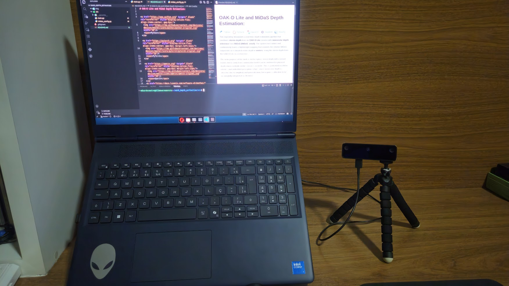
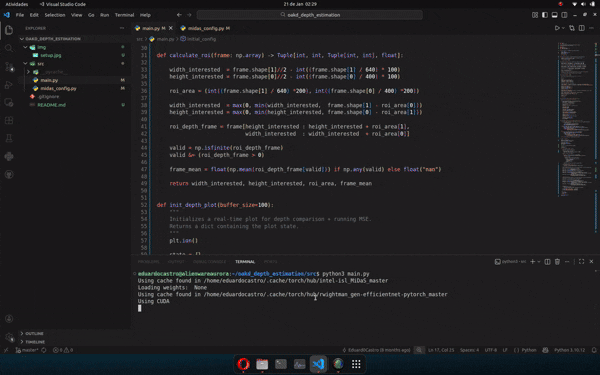

# OAK-D Lite and MiDaS Depth Estimation: 

<div align="center">
<a href="https://www.python.org" target="_blank" rel="noreferrer" style="display:inline-flex; align-items:center; gap:6px;">
  
  <span>Python</span>
</a>

<a href="https://pytorch.org" target="_blank" rel="noreferrer" style="display:inline-flex; align-items:center; gap:6px; margin-left:12px;">
  
  <span>PyTorch</span>
</a>

<a href="https://opencv.org" target="_blank" rel="noreferrer" style="display:inline-flex; align-items:center; gap:6px; margin-left:12px;">
  
  <span>OpenCV</span>
</a>
<a href="https://docs.luxonis.com/software-v3/depthai/" target="_blank" rel="noreferrer" style="display:inline-flex; align-items:center; gap:6px; margin-left:12px;">
  
  <span>DepthAI</span>
</a>
<a href="https://numpy.org" target="_blank" rel="noreferrer" style="display:inline-flex; align-items:center; gap:6px; margin-left:12px;">
  
  <span>NumPy</span>
</a>
</div>

</br>
</br>

This repository documents a real-time depth estimation pipeline that combines **stereo depth** from an **OAK-D Lite** camera with **monocular depth inference** from **MiDaS (MiDaS_small)**. The system runs online and continuously learns a lightweight mapping that converts the relative MiDaS output into an estimated metric depth in **meters**, using the stereo depth from the OAK-D Lite as a reference.

The main purpose of this work is not to replace stereo depth with a neural model, but to study how a monocular model can be anchored to physical depth when a reliable metric sensor is available. This is particularly useful in robotics and embedded perception setups, where monocular depth is attractive due to simplicity and generalization, but requires calibration to be meaningfully interpreted as distance.

---
## Software Requirements

To run the project, install the tools available with their respective versions in `requirements.txt` with the following command:

```bash
pip install -r requirements.txt
```

Furthermore, there is a dependency on the code structure developed in a closed project by the Black Bee Drones team, from the Federal University of Itajubá, ```mirela_sdk``` for the tools for using OAK-D Lite. 
If you would like to replicate this project, please contact the team's software team by email at ```blackbeedrones@unifei.edu.br```.

---

## OAK-D Lite Camera

The **OAK-D Lite** is a DepthAI device that integrates a color camera (RGB) and two monochrome cameras used as a **stereo pair**. The stereo pair enables geometric depth estimation by comparing corresponding points between the left and right images. Because this process is grounded in camera geometry and known baseline separation, the resulting depth is naturally expressed in metric units.




---

## Stereo Depth: How OAK-D Estimates Metric Depth

Stereo depth relies on **triangulation**. Given a point observed in both left and right images, its horizontal displacement (disparity) is proportional to depth. In a simplified pinhole model, depth can be expressed as:

\[
Z = \frac{f \cdot B}{d}
\]

Where:
- \(Z\) is the depth in meters,
- \(f\) is the focal length (in pixels),
- \(B\) is the stereo baseline (meters),
- \(d\) is the disparity (pixels).

The OAK-D depth pipeline estimates disparity, refines it internally, and produces a dense depth map. In practice, stereo depth has characteristic limitations: it depends on texture, fails on reflective surfaces, and may produce invalid pixels (often 0) in occluded regions. For this reason, this project focuses on a region-based statistic rather than pixel-wise comparison.

---

## MiDaS: Monocular Depth Inference

**MiDaS** (by Intel ISL) is a monocular depth estimation model trained to predict depth from a single RGB image. It generalizes well across environments and preserves relative depth structure, but the output is not directly metric. MiDaS predicts a **scale-ambiguous** depth representation: values are consistent in relative ordering (near versus far), but the absolute magnitude depends on the scene and camera properties.

In this project, MiDaS is used in the `MiDaS_small` configuration, loaded via `torch.hub`. The RGB frame is transformed using the official MiDaS transforms and passed through the network to obtain a dense depth map, resized back to the original resolution via bicubic interpolation to match the stereo output resolution.

---

## Region of Interest (ROI) Strategy

Instead of using the entire depth map, the system measures depth in a **central Region of Interest (ROI)**. This ROI is defined proportionally from a reference resolution of **640 × 400**, where the ROI is **200 × 200** pixels, and scales linearly for other resolutions. The ROI is clamped to image bounds to remain valid for any frame size.

Within the ROI, only valid values contribute to the mean:
- finite values (`np.isfinite`)
- values strictly greater than zero

This provides a stable scalar depth estimate for both sources:
- \( \overline{Z}_{oak} \): average stereo depth in meters
- \( \overline{D}_{midas} \): average MiDaS depth in relative units

---

## Online Calibration: MiDaS to Meters

### MiDas Model
MiDaS produces relative depth values that often behave like a **disparity-like** signal: closer objects tend to yield larger outputs. This makes an inverse mapping a natural and effective approximation when a metric reference is available.

### Adopted inverse model
The calibration uses the following model:

\[
\overline{Z}_{oak} \approx \frac{a}{(\overline{D}_{midas} + \varepsilon)} + b
\]

Where:
- \(a\) is a scale parameter,
- \(b\) is an offset parameter,
- \(\varepsilon\) is a numerical stability constant to avoid division by zero.

Rewriting as a linear regression:

\[
\overline{Z}_{oak} = a \cdot x + b, \quad x = \frac{1}{(\overline{D}_{midas} + \varepsilon)}
\]

The parameters \(a\) and \(b\) are estimated by least squares using `numpy.polyfit(x, y, 1)`.

### Online update logic
During runtime, pairs \((\overline{D}_{midas}, \overline{Z}_{oak})\) are appended to a rolling buffer. The first calibration is computed once a minimum amount of data is available. After this, the calibration is periodically updated to compensate for drift in the monocular scale caused by lighting, exposure, scene texture and ROI content changes.

---

## Runtime Outputs and Interpretation

The system displays three synchronized windows:
- RGB frame captured from OAK-D Lite,
- OAK-D stereo depth map with ROI overlay and \( \overline{Z}_{oak} \) in meters,
- MiDaS depth map with ROI overlay and calibrated metric estimate \( \widehat{Z}_{midas} \) in meters.

After calibration, the MiDaS ROI depth is interpreted as:

\[
\widehat{Z}_{midas} = \frac{a}{(\overline{D}_{midas} + \varepsilon)} + b
\]

This metric estimate is locally valid within the scene conditions that produced the calibration sample set. It should be treated as an empirical metric mapping rather than an absolute guarantee of monocular metric depth.

---
## Real-Time Depth Error Monitoring

In addition to the visual comparison between stereo and monocular depth maps, the system continuously evaluates the discrepancy between both depth estimates using the Mean Squared Error (MSE). The MSE is computed online from the difference between the metric depth provided by the OAK-D stereo pipeline and the calibrated depth obtained from the MiDaS model within the region of interest.

As the calibration converges, the error tends to decrease over time, indicating a more consistent mapping between the relative monocular depth and the metric reference. When the scene remains stable and the depth distribution inside the region of interest does not change significantly, the MSE stabilizes at a lower value.

Conversely, the error increases whenever there are abrupt changes in the camera view, variations in scene geometry, or modifications in the depth content inside the region of interest. These events temporarily disrupt the calibration consistency, resulting in a higher error until new samples are accumulated and the calibration parameters are updated. This behavior highlights both the adaptive nature of the calibration process and the sensitivity of monocular depth estimation to scene dynamics.

The real-time visualization of depth signals and error evolution provides valuable insight into the reliability and stability of the calibrated monocular depth under different operating conditions.

---

## Demonstration

A short GIF is typically the most effective way to present the final behavior of the system, showing the three windows running in sync and the calibrated MiDaS value converging to the stereo depth.



---

## Implementation Notes

The core logic is split into two parts:
- `src/main.py` performs acquisition, inference, ROI extraction, calibration calls, and visualization.
- `src/midas_config.py` provides the `Midas` wrapper (model and transforms) and the `Calibrate` class (buffers and regression).

The calibration uses:
- rolling buffers (`deque`) for MiDaS and OAK-D ROI means,
- least squares fit via `numpy.polyfit`,
- numerical stability term `eps = 1e-6`.

---

## Project Structure

```
oakd_depth_estimation/
├── src/
│   ├── main.py
│   └── midas_config.py
├── .gitignore
└── README.md
```

---

## Conclusions and Perspectives

This project investigated the relationship between stereo-based metric depth estimation and monocular depth inference by comparing the OAK-D stereo pipeline with the MiDaS neural network. While the OAK-D provides physically grounded depth measurements directly expressed in meters, MiDaS outputs abstract, scale-ambiguous depth values that encode relative scene structure rather than absolute distance. As a result, monocular depth estimation alone is insufficient to describe the real-world geometry without an external reference.

By introducing an online inverse calibration strategy, the abstract MiDaS depth representation was successfully anchored to a metric reference provided by the stereo sensor. The calibration proved to be highly effective, allowing the monocular depth estimates to be interpreted in meters within the operating range of the scene. Once convergence was achieved, the Mean Squared Error between both depth estimates remained consistently low, even under abrupt scene changes, variations in camera viewpoint, and dynamic modifications in the depth distribution inside the region of interest. Temporary increases in error were observed during sudden transitions, but the adaptive recalibration mechanism rapidly compensated for these deviations.

These results highlight a fundamental limitation of monocular depth models: despite their strong generalization capabilities, their outputs remain inherently relative and require an external geometric or physical reference to become meaningful in real-world applications. When combined with a calibrated sensor, however, monocular depth estimation becomes a powerful complementary tool, capable of providing dense depth cues where stereo may struggle.

From an application standpoint, this approach opens a broad range of possibilities for robotics and perception systems. The integration of calibrated monocular depth with stereo sensing is particularly relevant for autonomous navigation, SLAM pipelines, obstacle avoidance, and scene understanding in environments where sensor constraints or computational trade-offs must be carefully balanced. Furthermore, the modular structure of the system allows seamless extension to additional MiDaS variants. Ongoing work includes a rigorous evaluation of other MiDaS models to analyze the trade-offs between accuracy, robustness, and computational cost.

Overall, this project demonstrates that the fusion of learning-based monocular depth estimation with physically grounded stereo sensing provides a practical and effective pathway toward reliable metric perception in autonomous and robotic systems.

---

## Credits

Author: Eduardo Castro
**January, 2026**
